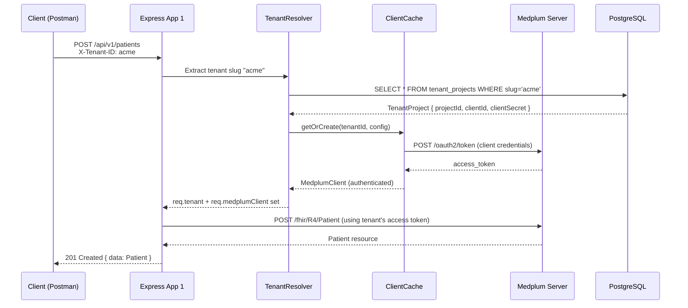
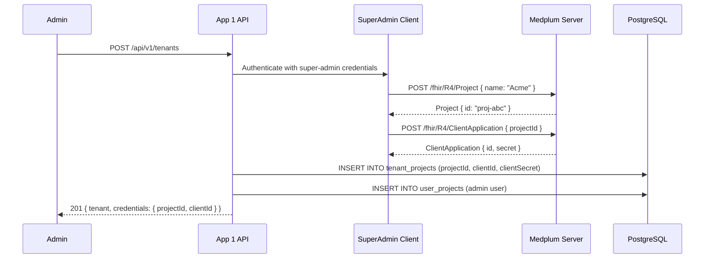
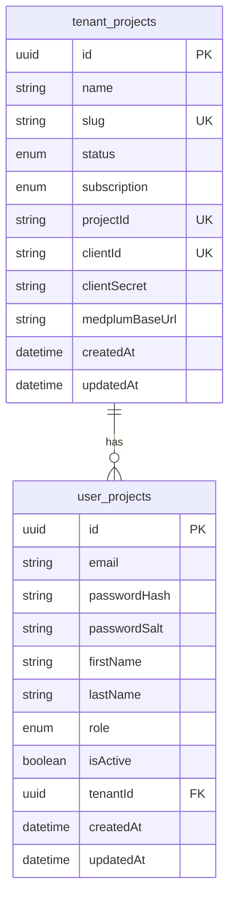

# Architecture — Option 1: Project-per-Tenant

## Overview

Each tenant is given a **dedicated Medplum Project** with its own OAuth2 Client Application.  
Tenant isolation is enforced by Medplum itself at the project boundary — one tenant cannot read another tenant's FHIR resources because they exist in separate projects.

## Key Characteristics

| Property | Value |
|----------|-------|
| Medplum Projects | 1 per tenant |
| OAuth Clients | 1 per tenant |
| Database (PostgreSQL) | Shared (logical separation by `tenantId` FK) |
| Medplum Client | Dynamically created per tenant, LRU-cached |
| Tenant Isolation | Enforced by Medplum project boundaries |

## Request Flow

## Tenant Registration Flow

## Database Schema (App 1)

## Strengths

- **Maximum isolation**: Medplum enforces project-level boundaries at the FHIR server level
- **Independent credentials**: Each tenant rotates their own credentials without affecting others
- **No cross-tenant data leak possible**: Even a bug in the application cannot return data across projects
- **Independent FHIR policies**: Each project can have different FHIR resource policies

## Trade-offs

- **Higher provisioning cost**: Registering a tenant requires super-admin API calls to create a Project + ClientApplication
- **More Medplum resources**: N tenants = N projects + N OAuth clients
- **Complexity**: The MedplumClientFactory + cache is required to route requests correctly
- **Scaling limit**: Medplum's project-level features (subscriptions, bots) are per-project
