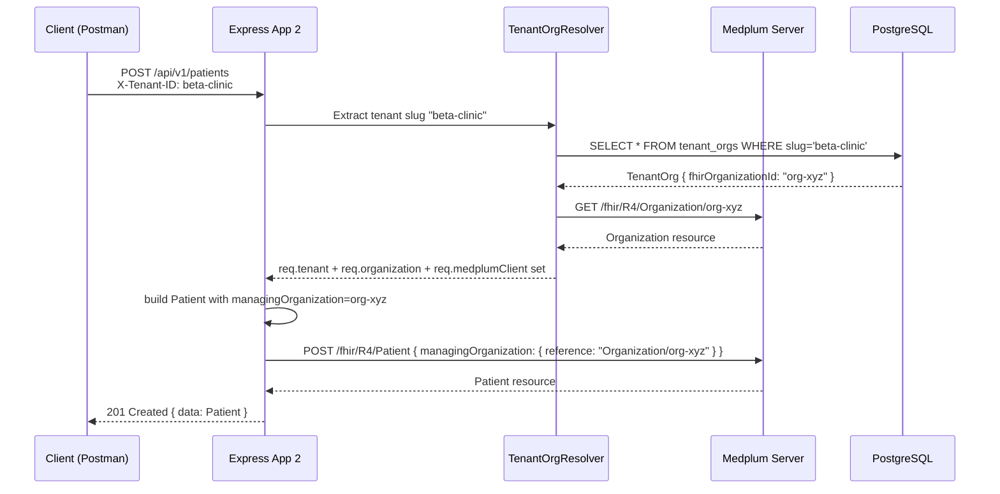
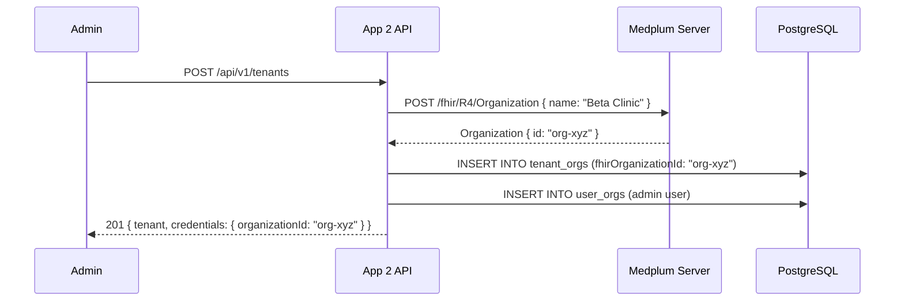
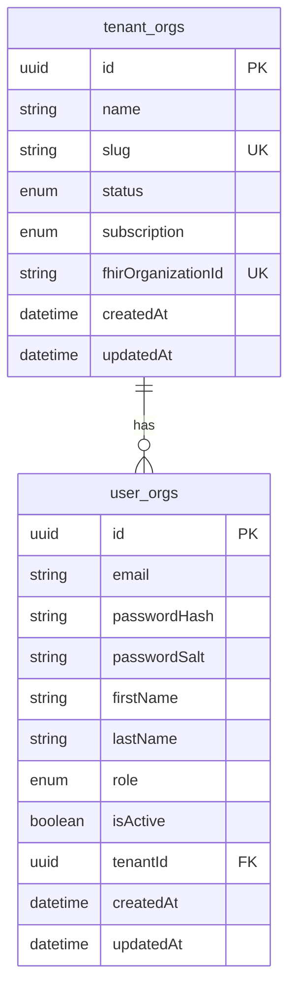

# Architecture — Option 2: Organization-per-Tenant

## Overview

All tenants share a **single Medplum Project**.  
Each tenant is represented as a **FHIR Organization** resource.  
Tenant isolation is enforced at the **application layer** by:

1. Stamping every Patient with `managingOrganization`
2. Linking every Practitioner via `PractitionerRole` pointing to the Organization
3. Attaching every Appointment with a custom Organization extension
4. Filtering all FHIR searches by Organization reference

## Key Characteristics

| Property | Value |
|----------|-------|
| Medplum Projects | 1 (shared) |
| OAuth Clients | 1 (shared) |
| FHIR Organization | 1 per tenant |
| Database (PostgreSQL) | Shared (logical separation by `tenantId` FK) |
| Medplum Client | Single shared instance (cached) |
| Tenant Isolation | Application-enforced via Organization reference |

## Request Flow



## Tenant Registration Flow



## Tenant Isolation Mechanisms

### Patient
```
Patient.managingOrganization = { reference: "Organization/{orgId}" }
```
Search always includes `organization=Organization/{orgId}`.  
Read always checks `managingOrganization` matches the tenant.

### Practitioner
```
PractitionerRole.organization = { reference: "Organization/{orgId}" }
```
Search traverses PractitionerRole to find only org-scoped practitioners.  
Read verifies a PractitionerRole exists linking Practitioner to the org.

### Appointment
```
Appointment.extension[url=appointment-organization].valueReference = Organization/{orgId}
```
Search post-filters by the org extension.  
Read checks the extension.

## Database Schema (App 2)



## Strengths

- **Simplest provisioning**: Creating a tenant is just a `createResource(Organization)` call
- **Single Medplum Project**: Easier operations — one set of configurations, one subscription namespace
- **Lower Medplum resource overhead**: Fewer projects, fewer clients
- **Cheaper at scale for smaller tenants**

## Trade-offs

- **Application-enforced isolation**: A bug could potentially leak cross-tenant data
- **FHIR search complexity**: Every query must include org filters
- **No native Medplum project-level isolation**: Relies on application code discipline
- **Audit complexity**: Harder to produce per-tenant audit logs from Medplum
- **Shared access token**: One token gives access to all tenants' FHIR data (mitigated by app-layer checks)
